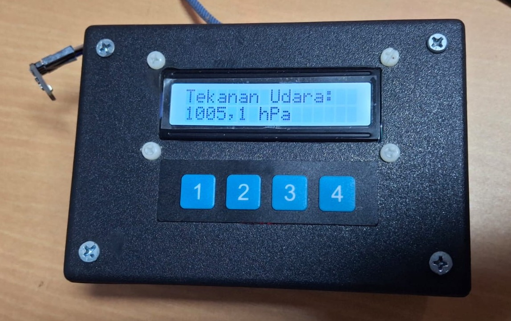
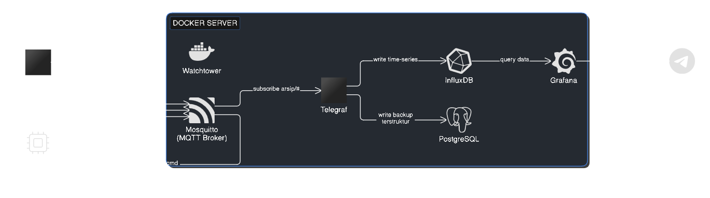

# Sistem Monitoring Suhu & Kelembapan - Ruang Arsip


<div style="display: flex; align-items: flex-start; gap: 20px;">

<div>

Sistem IoT untuk memantau suhu dan kelembapan ruang arsip secara real-time menggunakan ESP32, sensor BME280, MQTT, InfluxDB, PostgreSQL, dan Grafana — lengkap dengan kalibrasi jarak jauh dan notifikasi alert via Telegram.

## Daftar Isi

- [Arsitektur Sistem](#arsitektur-sistem)
- [Komponen Hardware](#komponen-hardware)
- [Struktur Proyek](#struktur-proyek)
- [Cara Kerja](#cara-kerja)
- [Setup & Instalasi](#setup--instalasi)
- [Kalibrasi Sensor](#kalibrasi-sensor)
- [Dashboard Grafana](#dashboard-grafana)
- [Alert / Notifikasi](#alert--notifikasi)
- [Menambah Node Baru](#menambah-node-baru)
- [Troubleshooting](#troubleshooting)
- [Catatan Jaringan Kantor](#catatan-jaringan-kantor)
- [Maintenance](#maintenance)

## Arsitektur Sistem

<div style="display: flex; align-items: flex-start; gap: 20px;">

<div>

Semua service backend berjalan di dalam **Docker** pada satu PC server di kantor. ESP32 terhubung ke WiFi kantor dan mengirim data secara wireless melalui MQTT — tidak ada kabel USB yang terpasang permanen ke perangkat.

## Komponen Hardware

| Komponen | Fungsi |
|---|---|
| Kotak IOT | Menyimpan semua kabel, sensor, dan MCU |
| ESP32 | Menjalankan program dan koneksi dengan jaringan |
| BME280 | Sensor suhu dan kelembapan |
| LCD 16x2 | Menampilkan data pada alat |
| 1x4 Push button | Mengkonfigurasi alat secara fisik |

## Struktur Proyek

```
IoT_Server/
├── docker-compose.yml
├── mosquitto/
│   └── config/
├── telegraf/
│   └── telegraf.conf
├── grafana/
│   ├── provisioning/
│   │   ├── datasources/
│   │   └── dashboards/        # <- file JSON dashboard disimpan di sini
│   └── Dockerfile              # (jika perlu custom CA certificate)
├── offset-control/
│   ├── app.py
│   └── Dockerfile
├── logs/                       # backup mentah data sensor (dari Telegraf)
└── esp32-bme280/
    └── bme280_main.ino
```

## Cara Kerja

### Alur Data
1. ESP32 membaca sensor BME280 tiap 30 detik dalam **Forced Mode** — sensor "tidur" di antara pembacaan untuk mencegah panas berlebih dan menjaga akurasi.
2. Data dikirim (publish) ke MQTT broker (Mosquitto) melalui topic:
   - `arsip/sensor_bme280` — data sensor
   - `arsip/sensor_bme280/config` — nilai offset kalibrasi yang sedang aktif
3. Telegraf berlangganan (subscribe) ke semua topic di bawah `arsip/#`, lalu menyimpan data tersebut ke:
   - **InfluxDB** — untuk visualisasi real-time di Grafana
   - **PostgreSQL** — sebagai backup terstruktur untuk query SQL
   - **File log mentah** (folder `./logs`) — backup tambahan di luar database
4. Grafana membaca dari InfluxDB dan menampilkan dashboard, serta mengirim alert ke Telegram jika suhu/kelembapan melewati ambang batas.

### Kalibrasi
ESP32 menyimpan dua nilai kalibrasi: `TEMP_OFFSET` dan `HUM_OFFSET`. Nilai ini disimpan di flash memory (`Preferences` library) sehingga tidak hilang saat perangkat restart.

Kalibrasi bisa dilakukan dengan 3 cara:
1. **Tombol fisik** — lihat [Kalibrasi Sensor](#kalibrasi-sensor)
2. **Form kalibrasi jarak jauh** — buka `http://<IP_SERVER>:5002` dari browser manapun di jaringan yang sama
3. **Publish MQTT manual** ke topic `arsip/sensor_bme280/cmd` dengan payload JSON seperti `{"temp_offset": 0.5, "hum_offset": -1}`

## Setup & Instalasi

### 1. Menjalankan server backend
```bash
cd IoT_Server
docker-compose up -d
```
Ini akan menjalankan semua service: Mosquitto, InfluxDB, PostgreSQL, Telegraf, Grafana, Watchtower, dan form kalibrasi.

### 2. Upload kode ke ESP32
Buka file `.ino` di Arduino IDE, sesuaikan:
- `ssid` dan `password` — kredensial WiFi
- `mqtt_server` — IP address server Docker

Install library yang dibutuhkan lewat Library Manager:
- `PubSubClient` (Nick O'Leary)
- `Adafruit BME280 Library` + `Adafruit Unified Sensor`
- `LiquidCrystal_I2C`
- `ArduinoJson` (Benoit Blanchon)

### 3. Akses dashboard
Buka `http://<IP_SERVER>:3000` (Grafana), login dengan kredensial di `docker-compose.yml`.

## Kalibrasi Sensor

### Tombol fisik

| Tombol | Fungsi |
|---|---|
| 1 (MODE) | Pindah mode: Normal → Edit Suhu → Edit Kelembapan → Normal |
| 2 (UP) | Menambah offset pada mode yang sedang aktif |
| 3 (RESET) | Di mode Normal: tampilkan/sembunyikan offset di LCD. Di mode Edit: kembalikan offset ke default |
| 4 (DOWN) | Mengurangi offset pada mode yang sedang aktif |

### Cara menghitung multiplier kalibrasi
Jika sensor tidak akurat dibanding alat referensi:
```
raw = (nilai_sekarang - offset_saat_ini) / multiplier_saat_ini
multiplier_baru = (nilai_target - offset_saat_ini) / raw
```

## Dashboard Grafana

Dashboard utama (`Monitoring Suhu & Kelembapan - Arsip Room`) menggunakan **template variable** (`sensor_topic`) yang otomatis mendeteksi node mana saja yang sedang aktif mengirim data dalam 10 menit terakhir. Artinya:
- Node baru yang mulai mengirim data akan otomatis muncul di dashboard
- Node yang berhenti mengirim data akan otomatis hilang dari dashboard setelah 10 menit

**Penting:** Dashboard ini di-*provision* dari file JSON di `grafana/provisioning/dashboards/`. Jangan edit langsung lewat UI Grafana untuk perubahan permanen — edit file JSON-nya, lalu restart container Grafana. Edit lewat UI bisa tertimpa kembali oleh file provisioning saat Grafana restart.

## Alert / Notifikasi

Alert dikirim ke **Telegram** saat suhu/kelembapan keluar dari ambang batas aman (default: 18-22°C, 45-55% RH — standar umum untuk preservasi arsip kertas/foto). Alert butuh kondisi bertahan minimal 5 menit sebelum benar-benar terkirim, untuk menghindari alarm palsu dari fluktuasi sesaat.

Setup dilakukan lewat Grafana → Alerting → Contact Points (Telegram Bot Token + Chat ID) dan Alert Rules.

## Menambah Node Baru

1. Siapkan ESP32 + sensor baru, gunakan pola penamaan topic yang konsisten:
   - `arsip/<nama_node>` — data sensor
   - `arsip/<nama_node>/config` — offset kalibrasi
   - `arsip/<nama_node>/cmd` — command kalibrasi jarak jauh
2. Tidak perlu mengubah konfigurasi Telegraf — sudah berlangganan wildcard `arsip/#`
3. Tidak perlu mengubah dashboard Grafana — node baru otomatis muncul dalam 10 menit setelah mulai mengirim data
4. Tambahkan entri device baru di `offset-control/app.py` (dictionary `DEVICES`) jika ingin bisa dikalibrasi lewat form web

## Troubleshooting

| Gejala | Kemungkinan Penyebab |
|---|---|
| Dashboard "No Data" di semua panel | Cek `docker ps` — pastikan semua container jalan. Cek `docker logs mosquitto` untuk konfirmasi ESP32 terhubung. |
| ESP32 connect WiFi tapi gagal MQTT | Kemungkinan **AP Isolation** aktif di jaringan kantor (lihat catatan di bawah) |
| Ping antar device gagal padahal semua online | AP Isolation memblokir lalu lintas antar-client, ini normal di jaringan kantor — bukan bug |
| Grafana gagal kirim alert Telegram (TLS error) | CA certificate bundle di image Grafana kadaluarsa — jalankan `docker-compose pull grafana && docker-compose up -d --force-recreate grafana` |
| Offset kalibrasi hilang setelah restart | Pastikan `Preferences` library benar-benar tersimpan (`saveOffsetsToFlash()` terpanggil setiap ada perubahan) |
| Data sensor melonjak ekstrem sesaat (ratusan derajat) | Sensor error/NaN sesaat, biasanya sebelum Forced Mode diterapkan — bisa diabaikan jika hanya beberapa titik data |
| IP server sering berubah setelah listrik padam/router restart | Gunakan **IP statis** untuk server agar tidak berubah setiap kali terjadi restart router/listrik padam |
| Image Docker/CA certificate lama kelamaan kadaluarsa | **Watchtower** berjalan otomatis setiap minggu untuk memperbarui image Docker tanpa perlu campur tangan manual |
| Koneksi ESP32 tidak stabil dalam jangka panjang | **ESP32 melakukan restart terjadwal setiap 12 jam** (mensimulasikan efek re-upload kode) untuk menjaga kestabilan koneksi jangka panjang |
| Perlu backup data di luar database | Cek folder `./logs` secara berkala — berisi backup mentah data sensor dari Telegraf |

